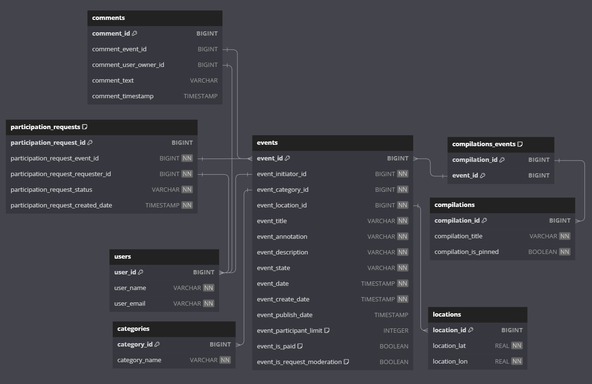
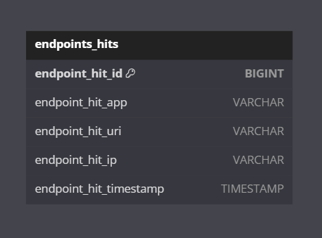

# ExploreWithMe

ExploreWithMe is an application that allows users to share information about interesting events and find companions to participate in them.

## Modules

1. **service**: The main application module.
2. **stats**: The statistics parent module.
3. **stats-server**: Statistics collection server.
4. **stats-dto**: DTO library for the statistics server.
5. **stats-client**: Client for interacting with the statistics server.

## API

### stats-server

https://github.com/AlexeyShary/java-explore-with-me/blob/main/ewm-stats-service-spec.json

### service

https://github.com/AlexeyShary/java-explore-with-me/blob/main/ewm-main-service-spec.json

## Data Schemas

### stats-server

### service

## Getting Started

To get started with ExploreWithMe, follow these steps:

1. Clone the repository: `git clone https://github.com/AlexeyShary/java-explore-with-me.git`
2. Navigate to the project directory: `cd java-explore-with-me`
3. Set up and configure each module as needed.
4. Build and run the application.

## Postman test collections

### stats-server detached

https://github.com/AlexeyShary/java-explore-with-me/blob/main-svc/Tests%20for%20detatched%20stats%20service.postman_collection.json

### main service + stats service

https://github.com/AlexeyShary/java-explore-with-me/blob/main-svc/Test%20Explore%20With%20Me%20-%20Main%20service.postman_collection.json